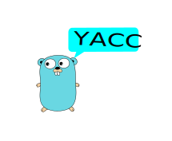

# YaccGo

[](https://opensource.org/licenses/MIT)

Through Google has tool about yacc named goyacc, But it generate go code can not debug! see the issue 

https://github.com/golang/vscode-go/issues/1674#event-5612030543 

I tried to modify the codes, It is not good readable, and I have no patient to do it, So I write a **YaccGo**

YaccGo is an unstantable and debugable Yacc in Go. . It is written in Go and generates parsers written in Go ,typescript, rust ...

# Quick Start
clone the code
```
make all
# generate the typescript parser code
bin/yaccgo generate typescript examples/exprts.y expts.ts

```
at your `y `file  You should do as follower
more in [manual](./Docs/manual.md)

# Trace
After generate the parse code, modify the `var IsTrace bool = false` to `var IsTrace bool = true` , then you can see the trace of the parser. feature completed for go, other are WIP.
for example:
```
bin/yaccgo generate go examples/ladd.y out/ladd.go
```
then you modify the ladd.go file, change code `var IsTrace bool = false` to `var IsTrace bool = true`, then
```
go run out/ladd.go
```
You can see trace information
```
look ahead NUM, use Reduce:PROG -> , go to state 1
Shift PROG, push state 1
Shift NUM, push state 3
look ahead PLUS, use Reduce:E -> NUM , go to state 2
Shift E, push state 2
Shift PLUS, push state 5
Shift NUM, push state 3
look ahead NL, use Reduce:E -> NUM , go to state 6
Shift E, push state 6
look ahead NL, use Reduce:E -> E PLUS E , go to state 2
Shift E, push state 2
Shift NL, push state 4
3
look ahead $, use Reduce:PROG -> PROG E NL , go to state 1
Shift PROG, push state 1
0
```

# Design

LALR1 Algorithm Base on

https://hassan-ait-kaci.net/pdf/others/p615-deremer.pdf

Lexer inspired from 

https://www.youtube.com/watch?v=HxaD_trXwRE

# RoadMap

1. support language:

- [x] go
- [x] typescript

- [ ] rust


2. DotGraph

   will support Dot Graph by svg

### Project use yaccgo

see [wiki](https://github.com/acekingke/yaccgo/wiki/Project-use-yaccgo)
and add your own project to it
### Contributing

Welcome to contributing, We appreciate your help! please make sure 

* `staticcheck` no error
* codes should has test 

## License


[MIT](LICENSE)
